# System Architecture Overview

This document provides a comprehensive overview of the AI Job Hunt Agent system architecture, including components, data flows, and technology stack.

## High-Level Architecture

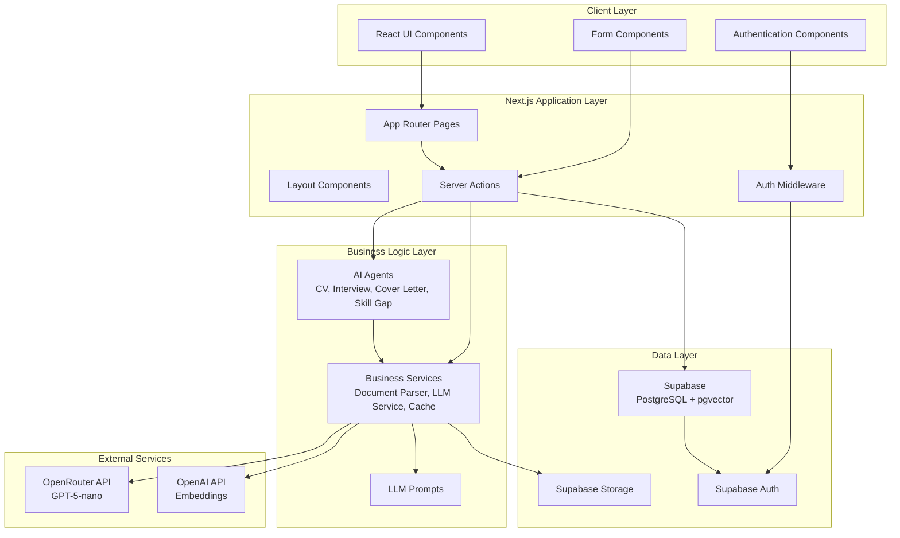

## Component Architecture

### Frontend Architecture

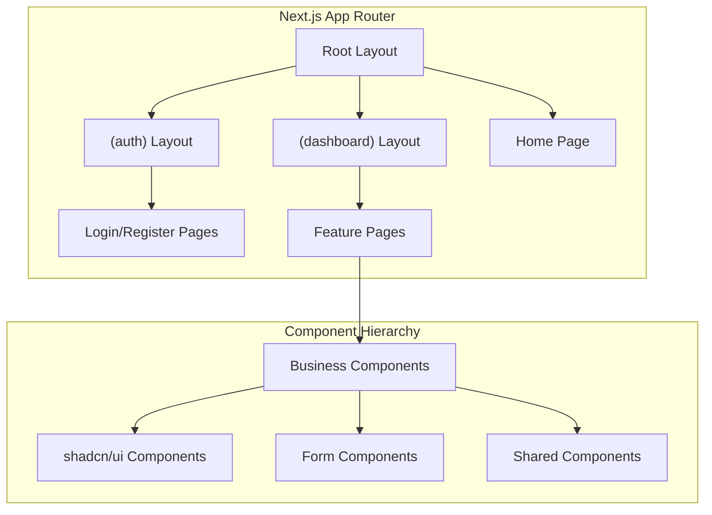

### AI Agent Architecture

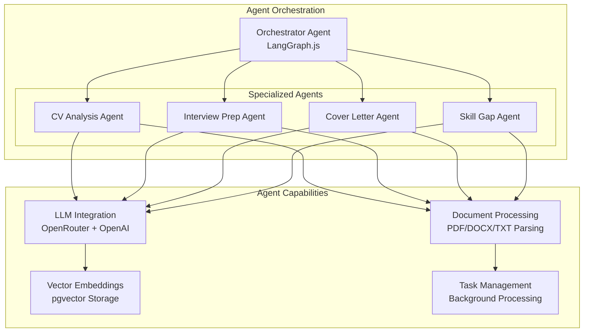

## Database Architecture

### Schema Overview

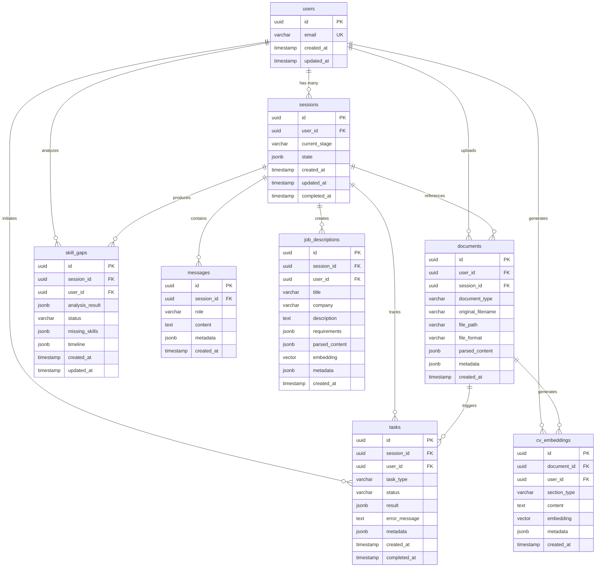

### Row Level Security (RLS)

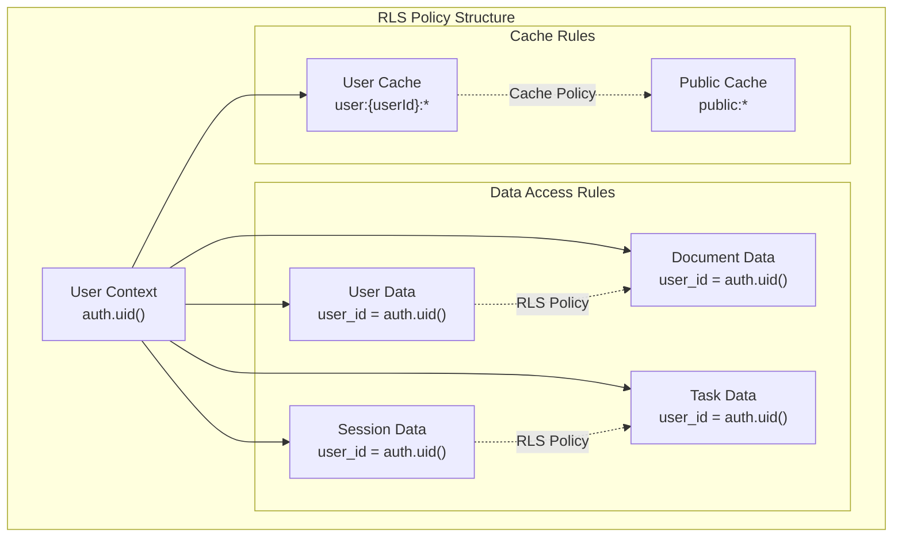

## Data Flow Architecture

### CV Analysis Flow

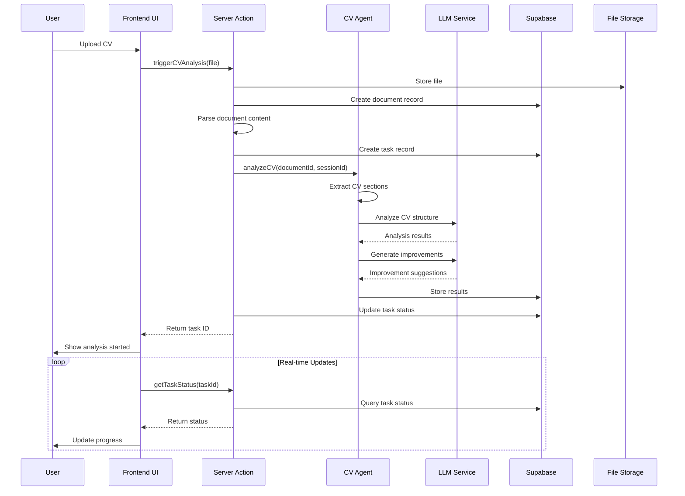

### Document Processing Flow

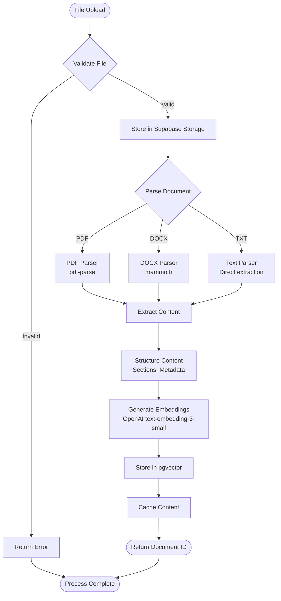

## Technology Stack

### Frontend Stack

| Technology | Version | Purpose |
|------------|---------|---------|
| Next.js | 16.0.0 | Full-stack React framework |
| React | 19.2.0 | UI library |
| TypeScript | 5.x | Type safety |
| Tailwind CSS | 4.x | Styling |
| shadcn/ui | Latest | Component library |
| Radix UI | Latest | Headless components |

### Backend Stack

| Technology | Version | Purpose |
|------------|---------|---------|
| Supabase | Latest | Backend-as-a-Service |
| PostgreSQL | Latest | Primary database |
| pgvector | Latest | Vector embeddings |
| Drizzle ORM | Latest | Type-safe database access |
| LangGraph.js | Latest | Agent orchestration |
| LangChain.js | Latest | LLM integration |

### AI/ML Stack

| Technology | Purpose |
|------------|---------|
| OpenRouter | LLM hosting (GPT-5-nano) |
| OpenAI | Text embeddings |
| LangChain | LLM orchestration tools |
| Vector Search | Semantic similarity matching |

## Security Architecture

### Authentication Flow

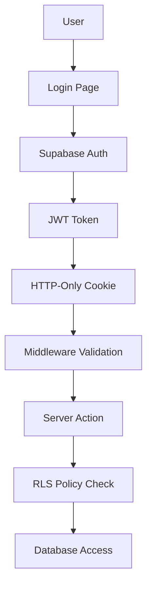

### Security Layers

1. **Authentication Layer**
   - Supabase Auth with JWT tokens
   - HTTP-only cookie sessions
   - Automatic token refresh

2. **Authorization Layer**
   - Row Level Security (RLS) policies
   - User-scoped data access
   - Cache access control via regex patterns

3. **Input Validation**
   - File type and size restrictions
   - Content sanitization
   - Type-safe Server Actions

4. **Rate Limiting**
   - PostgreSQL-based sliding window
   - User-specific rate limits
   - API endpoint protection

## Performance Architecture

### Caching Strategy

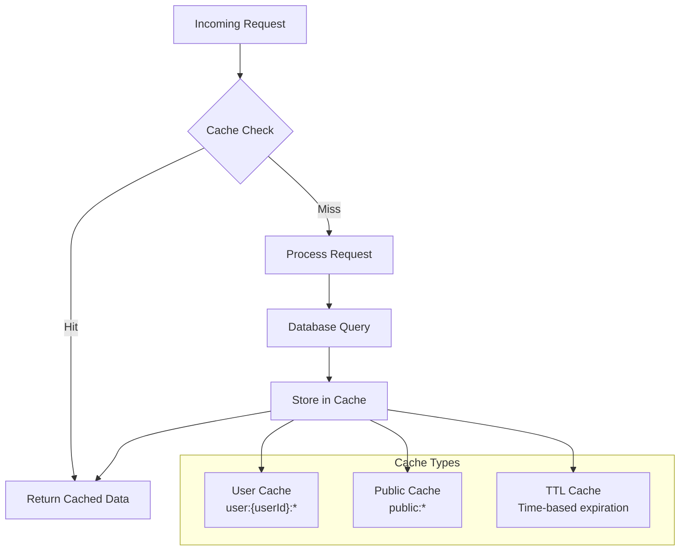

### Background Processing

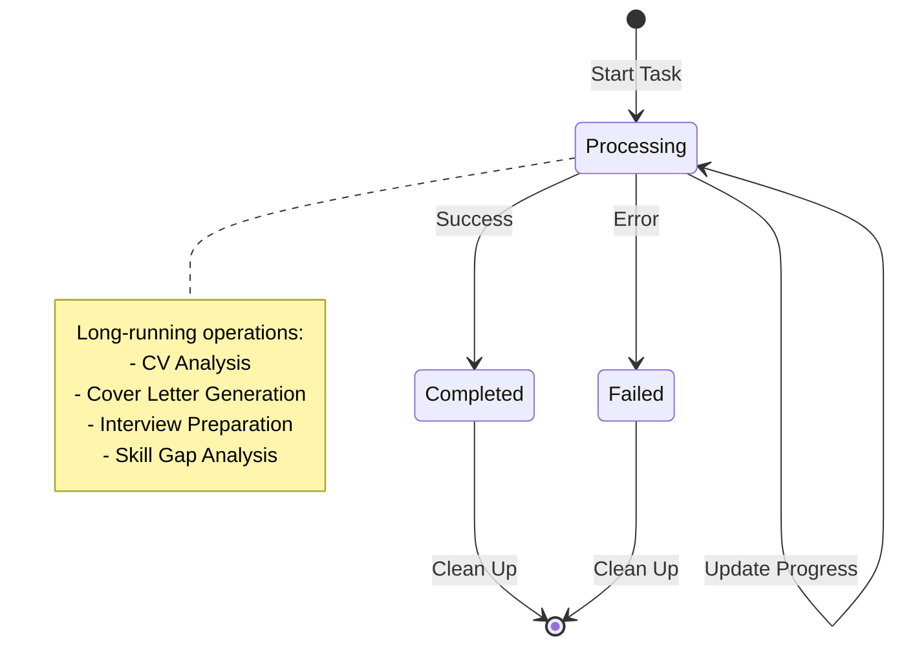

## Deployment Architecture

### Vercel Deployment

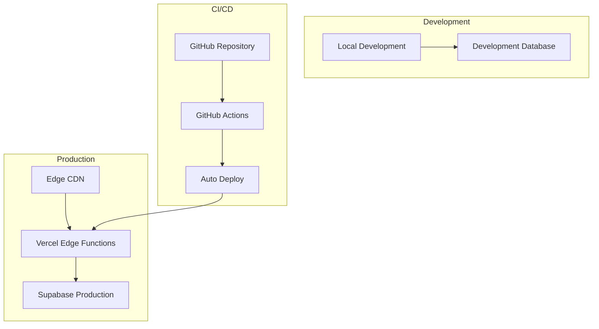

## Monitoring and Observability

### Error Handling

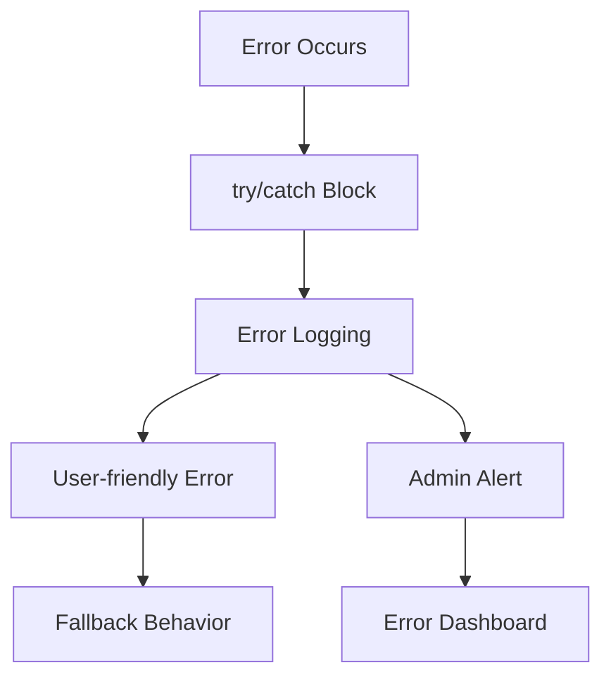

### Performance Monitoring

- **Client-side**: Web Vitals monitoring
- **Server-side**: Function execution times
- **Database**: Query performance tracking
- **External APIs**: Response time monitoring
- **User metrics**: Feature usage analytics

## Scalability Considerations

### Horizontal Scaling

- **Serverless Functions**: Vercel automatically scales
- **Database**: Supabase connection pooling
- **File Storage**: Supabase Storage auto-scaling
- **CDN**: Global edge distribution

### Optimization Strategies

1. **Database Optimization**
   - Proper indexing on foreign keys
   - Vector index for similarity search
   - Connection pooling

2. **Caching Layers**
   - Content caching with TTL
   - User-specific cache partitions
   - Database query result caching

3. **Resource Management**
   - Background job queuing
   - Memory-efficient document parsing
   - Lazy loading of large components

## Development Architecture

### Code Organization

```
src/
├── app/                    # Next.js App Router
│   ├── (auth)/            # Authentication routes
│   ├── (dashboard)/       # Protected routes
│   ├── api/               # API endpoints
│   ├── layout.tsx         # Root layout
│   └── page.tsx           # Home page
├── components/            # React components
│   ├── ui/               # shadcn/ui components
│   ├── auth/             # Auth components
│   └── [feature]/        # Feature components
├── actions/              # Server Actions
├── lib/                  # Library code
│   ├── agents/          # AI agents
│   ├── services/        # Business services
│   ├── prompts/         # LLM prompts
│   └── utils/           # Utilities
└── types/               # TypeScript definitions
```

### Development Workflow

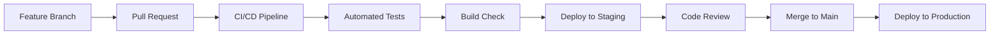

This architecture provides a robust, scalable, and maintainable foundation for the AI Job Hunt Agent application, ensuring security, performance, and excellent user experience.