# 🎯 Job Hunt Agent System - Architecture Specification (Next.js)

## **1. System Overview**

### **1.1 Project Description**

An AI-powered multi-agent system built with **Next.js 16** that helps job seekers improve their CVs, prepare for interviews, generate cover letters, and identify skill gaps. The system uses a guided workflow with human-in-the-loop validation, leveraging Next.js Server Components, Server Actions, and Route Handlers for a seamless full-stack experience.

### **1.2 Core Principles**

- **Privacy-First**: No automatic job applications or email sending
- **User Control**: Human approval required for CV changes
- **Multi-Agent Architecture**: Specialized agents for different tasks
- **Async Processing**: Long-running tasks handled via Server Actions and background jobs
- **Stateful**: Persistent conversation and session management
- **Full-Stack Next.js**: Unified frontend/backend with App Router

### **1.3 MVP Features**

1. **CV Analysis & Improvement** - Parse, analyze, and enhance resumes
2. **Cover Letter Generation** - Create personalized cover letters based on CV and JD
3. **Interview Preparation** - Generate mock questions and provide feedback
4. **Skill Gap Analysis** - Identify missing skills and learning roadmap

---

## **2. System Architecture**

### **2.1 High-Level Architecture**

#### **2.1.1 System Overview**

```mermaid
graph TB
    subgraph User["👤 User Layer"]
        Browser["🌐 Browser<br/>(React Client)"]
    end

    subgraph NextJS["🚀 Next.js 16 Application"]
        subgraph Presentation["🎨 Presentation Layer"]
            Pages["📄 Pages<br/>(Server Components)"]
            ClientComps["🖱️ Client Components<br/>(shadcn/ui)"]
        end

        subgraph API["🌐 API Layer"]
            RouteHandlers["🔌 Route Handlers<br/>(/api/*)"]
            ServerActions["⚡ Server Actions<br/>('use server')"]
            Middleware["🛡️ Middleware<br/>(Auth & CORS)"]
        end

        subgraph Business["⚙️ Business Logic"]
            Services["📦 Services<br/>(Document, LLM, Cache)"]
            Validation["✅ Validation<br/>(Zod Schemas)"]
        end
    end

    subgraph Agents["🤖 AI Agent System"]
        Orchestrator["🎯 Orchestrator<br/>(LangGraph.js)"]

        subgraph SpecializedAgents["Specialized Agents"]
            CVAgent["📄 CV Agent<br/>(Analysis & Improvement)"]
            InterviewAgent["🎤 Interview Agent<br/>(Mock Questions)"]
            CoverLetterAgent["✉️ Cover Letter Agent<br/>(Generation)"]
            SkillGapAgent["📚 Skill Gap Agent<br/>(Analysis)"]
        end
    end

    subgraph External["🧠 External Services"]
        OpenRouter["🤖 OpenRouter API<br/>(GPT-5-nano)"]
        OpenAI["🔮 OpenAI API<br/>(Embeddings)"]
    end

    subgraph Data["💾 Data & Storage"]
        subgraph Supabase["Supabase Platform"]
            PostgreSQL["🗄️ PostgreSQL<br/>(+ pgvector + cache)"]
            SupabaseStorage["📁 Storage<br/>(Files)"]
            SupabaseAuth["🔐 Auth<br/>(JWT)"]
        end
    end

    subgraph Monitoring["📈 Observability"]
        LangSmith["🔍 LangSmith<br/>(Agent Tracing)"]
        VercelAnalytics["📊 Vercel Analytics<br/>(Performance)"]
        ErrorTracking["🐛 Sentry<br/>(Error Tracking)"]
    end

    %% User to Next.js
    Browser -->|HTTP/WebSocket| Pages
    Browser -->|Interactions| ClientComps

    %% Presentation to API
    Pages -->|Data Fetching| RouteHandlers
    ClientComps -->|Form Submit| ServerActions
    ClientComps -->|API Calls| RouteHandlers

    %% API to Business
    RouteHandlers --> Services
    ServerActions --> Services
    Middleware -->|Protect| RouteHandlers
    Services --> Validation

    %% Business to Agents
    Services --> Orchestrator
    ServerActions --> Orchestrator

    %% Orchestrator to Specialized Agents
    Orchestrator --> CVAgent
    Orchestrator --> InterviewAgent
    Orchestrator --> CoverLetterAgent
    Orchestrator --> SkillGapAgent

    %% Agents to External Services
    CVAgent --> OpenRouter
    InterviewAgent --> OpenRouter
    CoverLetterAgent --> OpenRouter
    SkillGapAgent --> OpenRouter

    CVAgent --> OpenAI
    SkillGapAgent --> OpenAI

    %% Business to Data
    Services --> PostgreSQL
    Services --> SupabaseStorage

    %% Auth Integration
    Middleware --> SupabaseAuth
    SupabaseAuth --> PostgreSQL

    %% Monitoring
    Orchestrator -.->|Traces| LangSmith
    NextJS -.->|Metrics| VercelAnalytics
    NextJS -.->|Errors| ErrorTracking

    %% Styling
    classDef userStyle fill:#e3f2fd,stroke:#1976d2,stroke-width:3px,color:#000
    classDef nextjsStyle fill:#000000,stroke:#ffffff,stroke-width:3px,color:#fff
    classDef presentationStyle fill:#e1f5ff,stroke:#01579b,stroke-width:2px
    classDef apiStyle fill:#fff3e0,stroke:#e65100,stroke-width:2px
    classDef businessStyle fill:#f3e5f5,stroke:#7b1fa2,stroke-width:2px
    classDef agentStyle fill:#e8f5e9,stroke:#2e7d32,stroke-width:3px
    classDef specializedStyle fill:#c8e6c9,stroke:#1b5e20,stroke-width:2px
    classDef externalStyle fill:#fce4ec,stroke:#c2185b,stroke-width:3px
    classDef dataStyle fill:#fff8e1,stroke:#f57f17,stroke-width:3px
    classDef supabaseStyle fill:#ffe0b2,stroke:#e65100,stroke-width:2px
    classDef monitoringStyle fill:#efebe9,stroke:#5d4037,stroke-width:2px
    classDef backgroundStyle fill:#f1f8e9,stroke:#558b2f,stroke-width:2px

    class User,Browser userStyle
    class NextJS nextjsStyle
    class Presentation,Pages,ClientComps presentationStyle
    class API,RouteHandlers,ServerActions,Middleware apiStyle
    class Business,Services,Validation businessStyle
    class Agents,Orchestrator agentStyle
    class SpecializedAgents,CVAgent,InterviewAgent,CoverLetterAgent,SkillGapAgent specializedStyle
    class External,OpenRouter,OpenAI externalStyle
    class Data dataStyle
    class Supabase,PostgreSQL,SupabaseStorage,SupabaseAuth supabaseStyle
    class Monitoring,LangSmith,VercelAnalytics,ErrorTracking monitoringStyle
```



#### **2.1.2 Request Flow Architecture**


#### **2.1.3 Data Flow Diagram**

```mermaid
graph LR
    subgraph Input["📥 Input"]
        CVFile["CV File<br/>(PDF/DOCX)"]
        JDFile["JD File<br/>(PDF/DOCX)"]
        UserInput["User Messages"]
    end

    subgraph Processing["⚙️ Processing Pipeline"]
        Upload["1️⃣ File Upload<br/>(Supabase Storage)"]
        Parse["2️⃣ Document Parser<br/>(pdf-parse/mammoth)"]
        Embed["3️⃣ Embeddings<br/>(OpenAI)"]
        Analyze["4️⃣ Agent Analysis<br/>(LangGraph)"]
    end

    subgraph Storage["💾 Persistent Storage"]
        Files["File Storage<br/>(Supabase)"]
        Metadata["Document Metadata<br/>(PostgreSQL)"]
        Vectors["Vector Embeddings<br/>(pgvector)"]
        Sessions["Session State<br/>(PostgreSQL)"]
    end

    subgraph Output["📤 Output"]
        Analysis["CV Analysis<br/>(JSON)"]
        Suggestions["Improvements<br/>(Structured)"]
        Documents["Generated Docs<br/>(PDF/DOCX)"]
        Chat["Chat Responses<br/>(Streamed)"]
    end

    CVFile --> Upload
    JDFile --> Upload
    Upload --> Parse
    Upload --> Files

    Parse --> Metadata
    Parse --> Embed
    Parse --> Analyze

    Embed --> Vectors

    Analyze --> Analysis
    Analyze --> Suggestions
    Analyze --> Sessions

    Analysis --> Documents
    Suggestions --> Chat

    UserInput --> Analyze
    Sessions --> Analyze

    style Input fill:#e3f2fd,stroke:#1976d2,stroke-width:2px
    style Processing fill:#fff3e0,stroke:#f57c00,stroke-width:2px
    style Storage fill:#e8f5e9,stroke:#388e3c,stroke-width:2px
    style Output fill:#fce4ec,stroke:#c2185b,stroke-width:2px
```



---

## **3. Tech Stack**

### **3.1 Framework**

- **Next.js 16** (App Router, React Server Components, Server Actions)
- **React 19** (Server Components, use client/server directives)
- **TypeScript 5.7+** (Strict mode)
- **Node.js 22+**

### **3.2 Frontend**

- **UI Components**: **shadcn/ui** (Radix UI primitives)
  - Pre-built accessible components (Button, Card, Dialog, Form, etc.)
  - Tailwind CSS for styling
  - Dark mode support
  - Full TypeScript support
- **State Management**:
  - React Server Components (server state)
  - Zustand (client state for complex UI)
  - React Context (auth state)
- **Form Handling**:
  - React Hook Form + Zod validation
  - shadcn/ui Form components
- **File Upload**:
  - React Dropzone
  - shadcn/ui custom file upload component
- **Real-time**: Server-Sent Events (SSE) via Route Handlers
- **Icons**: Lucide React (used by shadcn/ui)

### **3.3 Backend (Next.js Server)**

- **API Layer**: Next.js Route Handlers (`app/api/*/route.ts`)
- **Server Actions**: Form actions and mutations (`'use server'`)
- **Agent Framework**: LangGraph.js + LangChain.js (TypeScript)
- **LLM Provider**: OpenRouter (openai/gpt-5-nano)
- **Embeddings**: OpenAI text-embedding-3-small
- **Background Jobs**:
  - Vercel Cron Jobs (scheduled tasks)
  - Server Actions with async processing
- **Document Processing**:
  - pdf-parse (PDF parsing)
  - mammoth (DOCX parsing)
  - PDFKit or jsPDF (document generation)

### **3.4 Database & Storage**

- **Primary DB**: Supabase PostgreSQL with pgvector extension
- **Vector Storage**: Supabase pgvector (embeddings)
- **File Storage**: Supabase Storage (S3-compatible)
- **Cache**: PostgreSQL (using dedicated cache table)
- **ORM**: Drizzle ORM (lightweight, type-safe)

### **3.5 Authentication**

- **Supabase Auth**:
  - Server-side auth with Next.js Middleware
  - Server Components integration
  - Client-side auth hooks
  - Cookie-based sessions
- **Features**: Email/password, OAuth, session management

### **3.6 Deployment**

- **Platform**: Vercel (optimized for Next.js)
- **Edge Runtime**: Vercel Edge Functions (for lightweight operations)
- **Node.js Runtime**: Vercel Serverless Functions (for agent processing)

---

## **4. Next.js Project Structure**

```
job-hunt-agent/
├── app/                                # Next.js App Router
│   ├── (auth)/                         # Auth route group
│   │   ├── login/
│   │   │   └── page.tsx                # Login page (Server Component)
│   │   ├── register/
│   │   │   └── page.tsx                # Register page
│   │   └── layout.tsx                  # Auth layout
│   ├── (dashboard)/                    # Protected routes
│   │   ├── dashboard/
│   │   │   └── page.tsx                # Dashboard (Server Component)
│   │   ├── workflow/
│   │   │   └── page.tsx                # Workflow page
│   │   ├── history/
│   │   │   └── page.tsx                # History page
│   │   ├── profile/
│   │   │   └── page.tsx                # Profile page
│   │   └── layout.tsx                  # Dashboard layout (with auth check)
│   ├── api/                            # Route Handlers
│   │   ├── auth/
│   │   │   ├── callback/route.ts       # Supabase auth callback
│   │   │   └── logout/route.ts         # Logout handler
│   │   ├── documents/
│   │   │   ├── upload/route.ts         # File upload handler
│   │   │   └── [id]/route.ts           # Get/Delete document
│   │   ├── agents/
│   │   │   ├── cv/
│   │   │   │   ├── analyze/route.ts    # CV analysis endpoint
│   │   │   │   └── improve/route.ts    # CV improvement endpoint
│   │   │   ├── interview/route.ts      # Interview agent
│   │   │   └── cover-letter/route.ts   # Cover letter agent
│   │   ├── sessions/
│   │   │   ├── route.ts                # Create/list sessions
│   │   │   └── [id]/route.ts           # Get/update session
│   │   ├── chat/
│   │   │   ├── message/route.ts        # Send chat message
│   │   │   └── stream/route.ts         # SSE chat stream
│   │   └── webhooks/
│   │       └── supabase/route.ts       # Supabase webhooks
│   ├── layout.tsx                      # Root layout
│   ├── page.tsx                        # Home page (Server Component)
│   └── globals.css                     # Global styles
├── components/                         # React components
│   ├── ui/                             # shadcn/ui components
│   │   ├── button.tsx
│   │   ├── card.tsx
│   │   ├── dialog.tsx
│   │   └── ...
│   ├── auth/
│   │   ├── login-form.tsx              # Client component
│   │   └── register-form.tsx
│   ├── chat/
│   │   ├── chat-interface.tsx          # Client component
│   │   ├── message-list.tsx
│   │   ├── message-input.tsx
│   │   └── agent-typing.tsx
│   ├── upload/
│   │   ├── file-uploader.tsx           # Client component
│   │   ├── cv-upload.tsx
│   │   └── jd-upload.tsx
│   ├── workflow/
│   │   ├── workflow-stepper.tsx
│   │   ├── approval-card.tsx
│   │   └── stage-progress.tsx
│   ├── cv/
│   │   ├── cv-preview.tsx
│   │   ├── cv-analysis.tsx
│   │   └── skill-gap-chart.tsx
│   └── layout/
│       ├── navbar.tsx
│       ├── sidebar.tsx
│       └── footer.tsx
├── lib/                                # Shared libraries
│   ├── agents/                         # LangGraph agents (TypeScript)
│   │   ├── orchestrator.ts
│   │   ├── cv-agent.ts
│   │   ├── interview-agent.ts
│   │   ├── cover-letter-agent.ts
│   │   └── skill-gap-agent.ts
│   ├── prompts/                        # LLM prompts
│   │   ├── cv-prompts.ts
│   │   ├── interview-prompts.ts
│   │   ├── cover-letter-prompts.ts
│   │   └── skill-gap-prompts.ts
│   ├── services/                       # Business logic
│   │   ├── llm-service.ts
│   │   ├── document-service.ts
│   │   ├── cache-service.ts
│   │   └── embedding-service.ts
│   ├── utils/                          # Helper functions
│   │   ├── document-parser.ts
│   │   ├── file-handler.ts
│   │   ├── validators.ts
│   │   └── cn.ts                       # Tailwind class merge
│   ├── db/                             # Database
│   │   ├── index.ts                    # Supabase client
│   │   ├── schema.ts                   # Drizzle schema
│   │   ├── queries.ts                  # Database queries
│   │   └── migrations/                 # SQL migrations
│   ├── supabase/                       # Supabase utilities
│   │   ├── client.ts                   # Browser client
│   │   ├── server.ts                   # Server client
│   │   └── middleware.ts               # Auth middleware
│   └── types/                          # TypeScript types
│       ├── database.ts                 # Supabase generated types
│       ├── agents.ts
│       └── workflow.ts
├── actions/                            # Server Actions
│   ├── auth.ts                         # 'use server' auth actions
│   ├── cv.ts                           # CV-related actions
│   ├── session.ts                      # Session actions
│   └── chat.ts                         # Chat actions
├── middleware.ts                       # Next.js middleware (auth)
├── drizzle.config.ts                   # Drizzle ORM config
├── next.config.js                      # Next.js config
├── tailwind.config.ts                  # Tailwind config
├── tsconfig.json                       # TypeScript config
├── package.json
├── .env.local                          # Environment variables
└── README.md
```

---

## **5. Database Schema**

### **5.1 Database Schema (Same as Original)**

The database schema remains identical to the original spec (see spec.md sections 6.1, 6.2, 6.3).

**Key Tables:**
- `users` (managed by Supabase Auth)
- `sessions`
- `documents`
- `conversations`
- `approvals`
- `skill_gaps`
- `tasks`
- `user_metrics`
- `llm_calls`
- `cache` (PostgreSQL-based caching)
- `rate_limits` (PostgreSQL-based rate limiting)
- `cv_embeddings` (pgvector)
- `jd_embeddings` (pgvector)
- `knowledge_embeddings` (pgvector)

**Drizzle ORM Example Schema:**

```typescript
// lib/db/schema.ts
import { pgTable, uuid, varchar, jsonb, timestamp, text, integer, decimal, vector } from 'drizzle-orm/pg-core';
import { sql } from 'drizzle-orm';

export const sessions = pgTable('sessions', {
  id: uuid('id').primaryKey().defaultRandom(),
  userId: uuid('user_id').notNull().references(() => users.id, { onDelete: 'cascade' }),
  currentStage: varchar('current_stage', { length: 50 }),
  state: jsonb('state'),
  createdAt: timestamp('created_at').defaultNow(),
  updatedAt: timestamp('updated_at').defaultNow(),
  completedAt: timestamp('completed_at'),
});

export const documents = pgTable('documents', {
  id: uuid('id').primaryKey().defaultRandom(),
  userId: uuid('user_id').notNull().references(() => users.id, { onDelete: 'cascade' }),
  sessionId: uuid('session_id').references(() => sessions.id, { onDelete: 'set null' }),
  documentType: varchar('document_type', { length: 50 }),
  originalFilename: varchar('original_filename', { length: 255 }),
  filePath: varchar('file_path', { length: 500 }),
  fileFormat: varchar('file_format', { length: 10 }),
  parsedContent: jsonb('parsed_content'),
  metadata: jsonb('metadata'),
  createdAt: timestamp('created_at').defaultNow(),
});

export const cvEmbeddings = pgTable('cv_embeddings', {
  id: uuid('id').primaryKey().defaultRandom(),
  documentId: uuid('document_id').notNull().references(() => documents.id, { onDelete: 'cascade' }),
  userId: uuid('user_id').notNull(),
  sectionType: varchar('section_type', { length: 50 }),
  content: text('content'),
  embedding: vector('embedding', { dimensions: 1536 }), // OpenAI text-embedding-3-small
  metadata: jsonb('metadata'),
  createdAt: timestamp('created_at').defaultNow(),
});

// Cache table
export const cache = pgTable('cache', {
  id: uuid('id').primaryKey().defaultRandom(),
  key: varchar('key', { length: 255 }).unique().notNull(),
  value: jsonb('value').notNull(),
  expiresAt: timestamp('expires_at'),
  createdAt: timestamp('created_at').defaultNow(),
});

// Rate limits table
export const rateLimits = pgTable('rate_limits', {
  id: uuid('id').primaryKey().defaultRandom(),
  identifier: varchar('identifier', { length: 255 }).notNull(),
  createdAt: timestamp('created_at').defaultNow(),
});

// ... more tables
```

---

## **6. Authentication with Next.js**

### **6.1 Supabase Auth Setup**

```typescript
// lib/supabase/server.ts - Server-side Supabase client
import { createServerClient, type CookieOptions } from '@supabase/ssr'
import { cookies } from 'next/headers'

export async function createClient() {
  const cookieStore = await cookies()

  return createServerClient(
    process.env.NEXT_PUBLIC_SUPABASE_URL!,
    process.env.NEXT_PUBLIC_SUPABASE_ANON_KEY!,
    {
      cookies: {
        get(name: string) {
          return cookieStore.get(name)?.value
        },
        set(name: string, value: string, options: CookieOptions) {
          cookieStore.set({ name, value, ...options })
        },
        remove(name: string, options: CookieOptions) {
          cookieStore.set({ name, value: '', ...options })
        },
      },
    }
  )
}
```

```typescript
// lib/supabase/client.ts - Client-side Supabase client
import { createBrowserClient } from '@supabase/ssr'

export function createClient() {
  return createBrowserClient(
    process.env.NEXT_PUBLIC_SUPABASE_URL!,
    process.env.NEXT_PUBLIC_SUPABASE_ANON_KEY!
  )
}
```

```typescript
// middleware.ts - Auth middleware
import { type NextRequest } from 'next/server'
import { updateSession } from '@/lib/supabase/middleware'

export async function middleware(request: NextRequest) {
  return await updateSession(request)
}

export const config = {
  matcher: [
    '/((?!_next/static|_next/image|favicon.ico|.*\\.(?:svg|png|jpg|jpeg|gif|webp)$).*)',
  ],
}
```

```typescript
// lib/supabase/middleware.ts
import { createServerClient, type CookieOptions } from '@supabase/ssr'
import { NextResponse, type NextRequest } from 'next/server'

export async function updateSession(request: NextRequest) {
  let response = NextResponse.next({
    request: {
      headers: request.headers,
    },
  })

  const supabase = createServerClient(
    process.env.NEXT_PUBLIC_SUPABASE_URL!,
    process.env.NEXT_PUBLIC_SUPABASE_ANON_KEY!,
    {
      cookies: {
        get(name: string) {
          return request.cookies.get(name)?.value
        },
        set(name: string, value: string, options: CookieOptions) {
          request.cookies.set({ name, value, ...options })
          response = NextResponse.next({
            request: {
              headers: request.headers,
            },
          })
          response.cookies.set({ name, value, ...options })
        },
        remove(name: string, options: CookieOptions) {
          request.cookies.set({ name, value: '', ...options })
          response = NextResponse.next({
            request: {
              headers: request.headers,
            },
          })
          response.cookies.set({ name, value: '', ...options })
        },
      },
    }
  )

  // Refresh session if expired
  await supabase.auth.getUser()

  // Protect dashboard routes
  const { data: { user } } = await supabase.auth.getUser()

  if (!user && request.nextUrl.pathname.startsWith('/dashboard')) {
    return NextResponse.redirect(new URL('/login', request.url))
  }

  return response
}
```

### **6.2 Server Actions for Auth**

```typescript
// actions/auth.ts
'use server'

import { revalidatePath } from 'next/cache'
import { redirect } from 'next/navigation'
import { createClient } from '@/lib/supabase/server'

export async function login(formData: FormData) {
  const supabase = await createClient()

  const data = {
    email: formData.get('email') as string,
    password: formData.get('password') as string,
  }

  const { error } = await supabase.auth.signInWithPassword(data)

  if (error) {
    return { error: error.message }
  }

  revalidatePath('/', 'layout')
  redirect('/dashboard')
}

export async function signup(formData: FormData) {
  const supabase = await createClient()

  const data = {
    email: formData.get('email') as string,
    password: formData.get('password') as string,
    options: {
      data: {
        full_name: formData.get('full_name') as string,
      },
    },
  }

  const { error } = await supabase.auth.signUp(data)

  if (error) {
    return { error: error.message }
  }

  revalidatePath('/', 'layout')
  redirect('/dashboard')
}

export async function logout() {
  const supabase = await createClient()
  await supabase.auth.signOut()
  redirect('/login')
}
```

---

## **7. API Routes (Route Handlers)**

### **7.1 Document Upload**

```typescript
// app/api/documents/upload/route.ts
import { NextRequest, NextResponse } from 'next/server'
import { createClient } from '@/lib/supabase/server'
import { DocumentService } from '@/lib/services/document-service'

export async function POST(request: NextRequest) {
  const supabase = await createClient()

  // Check authentication
  const { data: { user }, error: authError } = await supabase.auth.getUser()
  if (authError || !user) {
    return NextResponse.json({ error: 'Unauthorized' }, { status: 401 })
  }

  try {
    const formData = await request.formData()
    const file = formData.get('file') as File
    const documentType = formData.get('type') as string // 'cv' or 'jd'

    if (!file) {
      return NextResponse.json({ error: 'No file provided' }, { status: 400 })
    }

    // Upload to Supabase Storage
    const documentService = new DocumentService(supabase)
    const result = await documentService.uploadDocument(user.id, file, documentType)

    return NextResponse.json({
      success: true,
      document: result,
    })
  } catch (error: any) {
    console.error('Upload error:', error)
    return NextResponse.json(
      { error: error.message || 'Upload failed' },
      { status: 500 }
    )
  }
}
```

### **7.2 CV Analysis Endpoint**

```typescript
// app/api/agents/cv/analyze/route.ts
import { NextRequest, NextResponse } from 'next/server'
import { createClient } from '@/lib/supabase/server'
import { CVAgent } from '@/lib/agents/cv-agent'

export async function POST(request: NextRequest) {
  const supabase = await createClient()

  const { data: { user }, error: authError } = await supabase.auth.getUser()
  if (authError || !user) {
    return NextResponse.json({ error: 'Unauthorized' }, { status: 401 })
  }

  try {
    const { documentId, sessionId } = await request.json()

    const cvAgent = new CVAgent(supabase)
    const analysis = await cvAgent.analyzeCV(documentId, sessionId, user.id)

    return NextResponse.json({
      success: true,
      analysis,
    })
  } catch (error: any) {
    console.error('CV analysis error:', error)
    return NextResponse.json(
      { error: error.message || 'Analysis failed' },
      { status: 500 }
    )
  }
}

// Use Edge Runtime for faster cold starts
export const runtime = 'nodejs' // or 'edge' for lightweight operations
```

### **7.3 Server-Sent Events (SSE) for Chat Streaming**

```typescript
// app/api/chat/stream/route.ts
import { NextRequest } from 'next/server'
import { createClient } from '@/lib/supabase/server'
import { ChatOrchestrator } from '@/lib/agents/orchestrator'

export async function POST(request: NextRequest) {
  const supabase = await createClient()

  const { data: { user }, error: authError } = await supabase.auth.getUser()
  if (authError || !user) {
    return new Response('Unauthorized', { status: 401 })
  }

  const { sessionId, message } = await request.json()

  const encoder = new TextEncoder()
  const stream = new ReadableStream({
    async start(controller) {
      const orchestrator = new ChatOrchestrator(supabase)

      // Stream responses from LangGraph agent
      const responseStream = await orchestrator.streamMessage(sessionId, message, user.id)

      for await (const chunk of responseStream) {
        const data = `data: ${JSON.stringify(chunk)}\n\n`
        controller.enqueue(encoder.encode(data))
      }

      controller.close()
    },
  })

  return new Response(stream, {
    headers: {
      'Content-Type': 'text/event-stream',
      'Cache-Control': 'no-cache',
      'Connection': 'keep-alive',
    },
  })
}

export const runtime = 'nodejs'
```

---

## **8. Server Actions**

### **8.1 CV Improvement Server Action**

```typescript
// actions/cv.ts
'use server'

import { revalidatePath } from 'next/cache'
import { createClient } from '@/lib/supabase/server'
import { CVAgent } from '@/lib/agents/cv-agent'

export async function improveCVAction(sessionId: string, documentId: string) {
  const supabase = await createClient()

  const { data: { user }, error: authError } = await supabase.auth.getUser()
  if (authError || !user) {
    throw new Error('Unauthorized')
  }

  try {
    const cvAgent = new CVAgent(supabase)
    const improvements = await cvAgent.generateImprovements(documentId, sessionId, user.id)

    // Revalidate the workflow page to show new suggestions
    revalidatePath(`/workflow/${sessionId}`)

    return {
      success: true,
      improvements,
    }
  } catch (error: any) {
    console.error('CV improvement error:', error)
    return {
      success: false,
      error: error.message,
    }
  }
}

export async function approveCVChangesAction(
  approvalId: string,
  decision: 'approve' | 'reject',
  feedback?: string
) {
  const supabase = await createClient()

  const { data: { user }, error: authError } = await supabase.auth.getUser()
  if (authError || !user) {
    throw new Error('Unauthorized')
  }

  try {
    const cvAgent = new CVAgent(supabase)
    const result = await cvAgent.handleApproval(approvalId, decision, feedback, user.id)

    revalidatePath('/workflow')

    return {
      success: true,
      result,
    }
  } catch (error: any) {
    return {
      success: false,
      error: error.message,
    }
  }
}
```

### **8.2 Using Server Actions in Components**

```typescript
// components/workflow/approval-card.tsx
'use client'

import { useState, useTransition } from 'react'
import { approveCVChangesAction } from '@/actions/cv'
import { Button } from '@/components/ui/button'
import { Textarea } from '@/components/ui/textarea'

interface ApprovalCardProps {
  approval: {
    id: string
    originalContent: any
    proposedContent: any
    changeType: string
  }
}

export function ApprovalCard({ approval }: ApprovalCardProps) {
  const [feedback, setFeedback] = useState('')
  const [isPending, startTransition] = useTransition()

  const handleApprove = () => {
    startTransition(async () => {
      const result = await approveCVChangesAction(approval.id, 'approve', feedback)
      if (result.success) {
        // Show success message
      }
    })
  }

  const handleReject = () => {
    startTransition(async () => {
      const result = await approveCVChangesAction(approval.id, 'reject', feedback)
      if (result.success) {
        // Show success message
      }
    })
  }

  return (
    <div className="border rounded-lg p-4">
      <h3 className="font-semibold mb-2">Proposed Changes</h3>

      <div className="grid grid-cols-2 gap-4 mb-4">
        <div>
          <h4 className="text-sm font-medium mb-1">Original</h4>
          <pre className="text-sm bg-gray-50 p-2 rounded">
            {JSON.stringify(approval.originalContent, null, 2)}
          </pre>
        </div>
        <div>
          <h4 className="text-sm font-medium mb-1">Proposed</h4>
          <pre className="text-sm bg-green-50 p-2 rounded">
            {JSON.stringify(approval.proposedContent, null, 2)}
          </pre>
        </div>
      </div>

      <Textarea
        placeholder="Add feedback (optional)"
        value={feedback}
        onChange={(e) => setFeedback(e.target.value)}
        className="mb-4"
      />

      <div className="flex gap-2">
        <Button onClick={handleApprove} disabled={isPending}>
          {isPending ? 'Processing...' : 'Approve'}
        </Button>
        <Button variant="destructive" onClick={handleReject} disabled={isPending}>
          Reject
        </Button>
      </div>
    </div>
  )
}
```

---

## **9. LangGraph Agents (TypeScript)**

### **9.1 CV Agent with LangGraph.js**

```typescript
// lib/agents/cv-agent.ts
import { StateGraph, END } from '@langchain/langgraph'
import { ChatOpenAI } from '@langchain/openai'
import { SupabaseClient } from '@supabase/supabase-js'
import { CVPrompts } from '@/lib/prompts/cv-prompts'
import { DocumentService } from '@/lib/services/document-service'

interface CVState {
  userId: string
  sessionId: string
  documentId: string
  cvContent: any
  analysis: any
  improvements: any[]
  approvalStatus: 'pending' | 'approved' | 'rejected'
  error?: string
}

export class CVAgent {
  private supabase: SupabaseClient
  private llm: ChatOpenAI
  private documentService: DocumentService

  constructor(supabase: SupabaseClient) {
    this.supabase = supabase
    this.llm = new ChatOpenAI({
      modelName: 'gpt-5-nano',
      configuration: {
        baseURL: 'https://openrouter.ai/api/v1',
        apiKey: process.env.OPENROUTER_API_KEY,
      },
      streaming: true,
    })
    this.documentService = new DocumentService(supabase)
  }

  async analyzeCV(documentId: string, sessionId: string, userId: string) {
    const workflow = new StateGraph<CVState>({
      channels: {
        userId: null,
        sessionId: null,
        documentId: null,
        cvContent: null,
        analysis: null,
        improvements: null,
        approvalStatus: null,
        error: null,
      },
    })

    // Define nodes
    workflow.addNode('parse_cv', this.parseCVNode.bind(this))
    workflow.addNode('analyze_structure', this.analyzeStructureNode.bind(this))
    workflow.addNode('identify_improvements', this.identifyImprovementsNode.bind(this))
    workflow.addNode('generate_suggestions', this.generateSuggestionsNode.bind(this))

    // Define edges
    workflow.addEdge('__start__', 'parse_cv')
    workflow.addEdge('parse_cv', 'analyze_structure')
    workflow.addEdge('analyze_structure', 'identify_improvements')
    workflow.addEdge('identify_improvements', 'generate_suggestions')
    workflow.addEdge('generate_suggestions', END)

    const app = workflow.compile()

    // Execute workflow
    const result = await app.invoke({
      userId,
      sessionId,
      documentId,
      cvContent: null,
      analysis: null,
      improvements: [],
      approvalStatus: 'pending',
    })

    return result
  }

  private async parseCVNode(state: CVState): Promise<Partial<CVState>> {
    try {
      const document = await this.documentService.getDocument(state.documentId)
      const parsedContent = await this.documentService.parseDocument(document)

      return {
        cvContent: parsedContent,
      }
    } catch (error: any) {
      return { error: error.message }
    }
  }

  private async analyzeStructureNode(state: CVState): Promise<Partial<CVState>> {
    const prompt = CVPrompts.analyzeStructure(state.cvContent)
    const response = await this.llm.invoke(prompt)

    return {
      analysis: JSON.parse(response.content as string),
    }
  }

  private async identifyImprovementsNode(state: CVState): Promise<Partial<CVState>> {
    const prompt = CVPrompts.identifyImprovements(state.cvContent, state.analysis)
    const response = await this.llm.invoke(prompt)

    return {
      improvements: JSON.parse(response.content as string),
    }
  }

  private async generateSuggestionsNode(state: CVState): Promise<Partial<CVState>> {
    // Save improvements to database
    const { data, error } = await this.supabase
      .from('approvals')
      .insert({
        session_id: state.sessionId,
        agent_name: 'cv_agent',
        change_type: 'cv_improvement',
        original_content: state.cvContent,
        proposed_content: state.improvements,
        status: 'pending',
      })
      .select()
      .single()

    if (error) {
      return { error: error.message }
    }

    return {
      approvalStatus: 'pending',
    }
  }

  // ... more methods
}
```

---

## **10. Background Jobs**

### **10.1 Using Server Actions for Async Processing**

```typescript
// actions/cv.ts
'use server'

import { createClient } from '@/lib/supabase/server'
import { CVAgent } from '@/lib/agents/cv-agent'

export async function triggerCVAnalysis(documentId: string, sessionId: string) {
  const supabase = await createClient()
  const { data: { user }, error } = await supabase.auth.getUser()

  if (error || !user) {
    throw new Error('Unauthorized')
  }

  // Mark task as processing in database
  await supabase
    .from('tasks')
    .insert({
      session_id: sessionId,
      task_type: 'cv_analysis',
      status: 'processing',
      metadata: { documentId, userId: user.id },
    })

  // Execute async analysis (Vercel handles this with generous timeouts)
  try {
    const cvAgent = new CVAgent(supabase)

    // Step 1: Parse CV
    const parsedCV = await cvAgent.parseCV(documentId)

    // Step 2: Analyze CV
    const analysis = await cvAgent.analyze(parsedCV, sessionId, user.id)

    // Step 3: Generate improvements
    const improvements = await cvAgent.generateImprovements(analysis, sessionId, user.id)

    // Update task status
    await supabase
      .from('tasks')
      .update({
        status: 'completed',
        result: improvements,
        completed_at: new Date().toISOString(),
      })
      .eq('session_id', sessionId)
      .eq('task_type', 'cv_analysis')

    return { success: true, improvements }
  } catch (error: any) {
    // Update task status on error
    await supabase
      .from('tasks')
      .update({
        status: 'failed',
        error_message: error.message,
      })
      .eq('session_id', sessionId)
      .eq('task_type', 'cv_analysis')

    throw error
  }
}
```

### **10.2 Polling for Background Job Status**

```typescript
// lib/services/task-service.ts
import { SupabaseClient } from '@supabase/supabase-js'

export class TaskService {
  constructor(private supabase: SupabaseClient) {}

  async getTaskStatus(sessionId: string, taskType: string) {
    const { data, error } = await this.supabase
      .from('tasks')
      .select('*')
      .eq('session_id', sessionId)
      .eq('task_type', taskType)
      .order('created_at', { ascending: false })
      .limit(1)
      .single()

    if (error) throw error
    return data
  }

  async waitForTask(sessionId: string, taskType: string, maxWaitMs = 60000) {
    const startTime = Date.now()

    while (Date.now() - startTime < maxWaitMs) {
      const task = await this.getTaskStatus(sessionId, taskType)

      if (task.status === 'completed') {
        return task.result
      }

      if (task.status === 'failed') {
        throw new Error(task.error_message || 'Task failed')
      }

      // Wait 1 second before next poll
      await new Promise(resolve => setTimeout(resolve, 1000))
    }

    throw new Error('Task timeout')
  }
}
```

---

## **11. Environment Variables**

### **11.1 .env.local**

```bash
# Supabase
NEXT_PUBLIC_SUPABASE_URL=your_supabase_project_url
NEXT_PUBLIC_SUPABASE_ANON_KEY=your_supabase_anon_key
SUPABASE_SERVICE_ROLE_KEY=your_supabase_service_role_key  # For development/admin tasks only

# Database (for Drizzle ORM direct connection - optional)
DATABASE_URL=your_supabase_postgres_connection_string

# OpenRouter (LLM)
OPENROUTER_API_KEY=your_openrouter_api_key

# OpenAI (Embeddings)
OPENAI_API_KEY=your_openai_api_key

# LangSmith (Optional - for tracing)
LANGCHAIN_TRACING_V2=true
LANGCHAIN_PROJECT=job-hunt-agent
LANGCHAIN_API_KEY=your_langsmith_api_key

# File Storage
MAX_FILE_SIZE_MB=10

# Optional
TAVILY_API_KEY=your_tavily_key  # For web search
```

**Important Notes:**

- **`SUPABASE_SERVICE_ROLE_KEY` usage:** This key bypasses Row Level Security (RLS)
  - **Development:** Can be used for testing, database seeding, or admin operations
  - **Production:** NEVER use in production client-facing code - creates security vulnerabilities
- **For standard operations:** Use `NEXT_PUBLIC_SUPABASE_ANON_KEY` for client-side operations (respects RLS)
- Use server-side Supabase clients (via `createClient()`) which inherit user context from cookies
- `DATABASE_URL` is only needed if you want to use Drizzle ORM for direct database migrations, otherwise Supabase client handles everything

### **11.2 Row Level Security (RLS) Strategy**

**All tables must have RLS policies enabled to ensure data security:**

```sql
-- Enable RLS on cache table
ALTER TABLE cache ENABLE ROW LEVEL SECURITY;

-- Policy: Users can read/write their own cache entries
CREATE POLICY "Users can manage their own cache"
  ON cache
  FOR ALL
  USING (auth.uid()::text = substring(key from 'user:([^:]+)'))
  WITH CHECK (auth.uid()::text = substring(key from 'user:([^:]+)'));

-- Policy: Anonymous cache access (for public data)
CREATE POLICY "Public cache access"
  ON cache
  FOR SELECT
  USING (key LIKE 'public:%');

-- Enable RLS on rate_limits table
ALTER TABLE rate_limits ENABLE ROW LEVEL SECURITY;

-- Policy: Rate limits can be checked by anyone (identifier is IP or user ID)
CREATE POLICY "Anyone can check rate limits"
  ON rate_limits
  FOR ALL
  USING (true)
  WITH CHECK (true);

-- Enable RLS on tasks table
ALTER TABLE tasks ENABLE ROW LEVEL SECURITY;

-- Policy: Users can only access their own tasks
CREATE POLICY "Users can manage their own tasks"
  ON tasks
  FOR ALL
  USING (
    session_id IN (
      SELECT id FROM sessions WHERE user_id = auth.uid()
    )
  )
  WITH CHECK (
    session_id IN (
      SELECT id FROM sessions WHERE user_id = auth.uid()
    )
  );
```

**Updated Cache Service with RLS-Aware Keys:**

```typescript
// lib/services/cache-service.ts
import { SupabaseClient } from '@supabase/supabase-js'

export class CacheService {
  constructor(private supabase: SupabaseClient) {}

  // Generate RLS-safe cache key
  private getCacheKey(userId: string | undefined, key: string): string {
    if (userId) {
      return `user:${userId}:${key}`
    }
    return `public:${key}` // For public/anonymous cache
  }

  async get<T>(key: string, userId?: string): Promise<T | null> {
    const cacheKey = this.getCacheKey(userId, key)

    const { data, error } = await this.supabase
      .from('cache')
      .select('value, expires_at')
      .eq('key', cacheKey)
      .single()

    if (error || !data) return null

    // Check if expired
    if (data.expires_at && new Date(data.expires_at) < new Date()) {
      await this.delete(key, userId)
      return null
    }

    return data.value as T
  }

  async set<T>(key: string, value: T, userId?: string, ttlSeconds?: number): Promise<void> {
    const cacheKey = this.getCacheKey(userId, key)
    const expiresAt = ttlSeconds
      ? new Date(Date.now() + ttlSeconds * 1000).toISOString()
      : null

    await this.supabase
      .from('cache')
      .upsert({
        key: cacheKey,
        value: value as any,
        expires_at: expiresAt,
      })
  }

  async delete(key: string, userId?: string): Promise<void> {
    const cacheKey = this.getCacheKey(userId, key)
    await this.supabase
      .from('cache')
      .delete()
      .eq('key', cacheKey)
  }
}

// Usage with user context
const cacheService = new CacheService(supabase)
const { data: { user } } = await supabase.auth.getUser()
await cacheService.set('cv_analysis', analysisData, user?.id, 3600)
```

---

## **12. Deployment**

### **12.1 Vercel Deployment**

```javascript
// next.config.js
/** @type {import('next').NextConfig} */
const nextConfig = {
  experimental: {
    serverActions: {
      bodySizeLimit: '10mb', // For file uploads
    },
  },
  images: {
    domains: ['your-supabase-project.supabase.co'],
  },
}

module.exports = nextConfig
```

**Deployment Steps:**

1. Push code to GitHub
2. Connect repository to Vercel
3. Configure environment variables in Vercel dashboard
4. Deploy

**Vercel automatically handles:**
- Server-side rendering (SSR)
- API Routes (Route Handlers)
- Server Actions
- Image Optimization
- Edge Functions
- Caching & CDN

---

## **13. MVP Feature Prioritization**

### **Phase 1 (Weeks 1-2): Foundation**

- [ ] Next.js 16 project setup with App Router
- [ ] Supabase integration (Auth + Database)
- [ ] shadcn/ui setup (init and install components)
- [ ] Authentication (login/register pages with Server Actions)
- [ ] Basic layout (Navbar, Sidebar, Dashboard)
- [ ] Database schema & migrations (Drizzle ORM)
- [ ] File upload (CV, JD) with Supabase Storage

### **Phase 2 (Weeks 3-4): CV Agent**

- [ ] Document parsing service (PDF/DOCX)
- [ ] LangGraph.js CV agent
- [ ] CV analysis workflow
- [ ] Improvement suggestions
- [ ] Human-in-the-loop approval UI (using shadcn/ui Dialog, Card)
- [ ] Server Actions for CV operations
- [ ] Export improved CV

### **Phase 3 (Weeks 5-6): Additional Agents**

- [ ] Cover letter agent
- [ ] Skill gap analysis
- [ ] Interview preparation agent
- [ ] Background job processing (Server Actions + PostgreSQL tasks table)
- [ ] Real-time chat with SSE (using shadcn/ui ScrollArea)

### **Phase 4 (Week 7): Polish & Deployment**

- [ ] Error handling & validation (Zod + shadcn/ui Form)
- [ ] Loading states & skeletons (shadcn/ui Skeleton)
- [ ] Toast notifications (shadcn/ui Toast/Sonner)
- [ ] Session persistence
- [ ] Metrics tracking
- [ ] Testing (Vitest + Playwright)
- [ ] Deploy to Vercel

---

## **14. shadcn/ui Component Usage**

### **14.1 Core Components Used**

The following shadcn/ui components are essential for this project:

**Forms & Input:**
- `Form` - Form wrapper with React Hook Form integration
- `Input` - Text input fields
- `Textarea` - Multi-line text input
- `Button` - Primary action buttons
- `Label` - Form labels
- `Select` - Dropdown selections
- `Radio Group` - Radio button groups
- `Checkbox` - Checkboxes

**Layout & Navigation:**
- `Card` - Content containers (CV preview, analysis results)
- `Tabs` - Tab navigation (workflow stages)
- `Accordion` - Collapsible sections (CV sections)
- `Separator` - Visual dividers
- `ScrollArea` - Scrollable containers (chat interface)
- `Sheet` - Sidebar panel
- `Dialog` - Modal dialogs (approval gates, confirmations)

**Feedback & Status:**
- `Toast` or `Sonner` - Notifications
- `Alert` - Important messages
- `Progress` - Loading progress bars
- `Skeleton` - Loading states
- `Badge` - Status indicators
- `Avatar` - User avatars

**Data Display:**
- `Table` - Data tables (session history)
- `Tooltip` - Contextual help
- `Popover` - Floating content
- `Dropdown Menu` - Context menus
- `Command` - Command palette (optional)

### **14.2 Installation**

```bash
# Initialize shadcn/ui
npx shadcn@latest init

# Install required components
npx shadcn@latest add button
npx shadcn@latest add card
npx shadcn@latest add dialog
npx shadcn@latest add form
npx shadcn@latest add input
npx shadcn@latest add textarea
npx shadcn@latest add label
npx shadcn@latest add select
npx shadcn@latest add toast
npx shadcn@latest add tabs
npx shadcn@latest add accordion
npx shadcn@latest add scroll-area
npx shadcn@latest add skeleton
npx shadcn@latest add badge
npx shadcn@latest add alert
npx shadcn@latest add progress
npx shadcn@latest add table
npx shadcn@latest add sheet
npx shadcn@latest add dropdown-menu
npx shadcn@latest add avatar
npx shadcn@latest add separator
```

### **14.3 Example Component with shadcn/ui**

```typescript
// components/auth/login-form.tsx
'use client'

import { zodResolver } from '@hookform/resolvers/zod'
import { useForm } from 'react-hook-form'
import * as z from 'zod'
import { Button } from '@/components/ui/button'
import {
  Form,
  FormControl,
  FormDescription,
  FormField,
  FormItem,
  FormLabel,
  FormMessage,
} from '@/components/ui/form'
import { Input } from '@/components/ui/input'
import { toast } from 'sonner'
import { login } from '@/actions/auth'

const formSchema = z.object({
  email: z.string().email({ message: 'Invalid email address' }),
  password: z.string().min(6, { message: 'Password must be at least 6 characters' }),
})

export function LoginForm() {
  const form = useForm<z.infer<typeof formSchema>>({
    resolver: zodResolver(formSchema),
    defaultValues: {
      email: '',
      password: '',
    },
  })

  async function onSubmit(values: z.infer<typeof formSchema>) {
    const formData = new FormData()
    formData.append('email', values.email)
    formData.append('password', values.password)

    const result = await login(formData)

    if (result?.error) {
      toast.error('Login failed', {
        description: result.error,
      })
    } else {
      toast.success('Login successful')
    }
  }

  return (
    <Form {...form}>
      <form onSubmit={form.handleSubmit(onSubmit)} className="space-y-6">
        <FormField
          control={form.control}
          name="email"
          render={({ field }) => (
            <FormItem>
              <FormLabel>Email</FormLabel>
              <FormControl>
                <Input placeholder="you@example.com" {...field} />
              </FormControl>
              <FormMessage />
            </FormItem>
          )}
        />
        <FormField
          control={form.control}
          name="password"
          render={({ field }) => (
            <FormItem>
              <FormLabel>Password</FormLabel>
              <FormControl>
                <Input type="password" placeholder="••••••••" {...field} />
              </FormControl>
              <FormMessage />
            </FormItem>
          )}
        />
        <Button type="submit" className="w-full">
          Sign In
        </Button>
      </form>
    </Form>
  )
}
```

### **14.4 Approval Card with shadcn/ui**

```typescript
// components/workflow/approval-card.tsx
'use client'

import { useState, useTransition } from 'react'
import { approveCVChangesAction } from '@/actions/cv'
import { Button } from '@/components/ui/button'
import {
  Card,
  CardContent,
  CardDescription,
  CardFooter,
  CardHeader,
  CardTitle,
} from '@/components/ui/card'
import { Textarea } from '@/components/ui/textarea'
import { Label } from '@/components/ui/label'
import { Badge } from '@/components/ui/badge'
import { Separator } from '@/components/ui/separator'
import { CheckCircle2, XCircle } from 'lucide-react'
import { toast } from 'sonner'

interface ApprovalCardProps {
  approval: {
    id: string
    originalContent: any
    proposedContent: any
    changeType: string
  }
}

export function ApprovalCard({ approval }: ApprovalCardProps) {
  const [feedback, setFeedback] = useState('')
  const [isPending, startTransition] = useTransition()

  const handleApprove = () => {
    startTransition(async () => {
      const result = await approveCVChangesAction(approval.id, 'approve', feedback)
      if (result.success) {
        toast.success('Changes approved', {
          description: 'Your CV has been updated successfully.',
        })
      } else {
        toast.error('Failed to approve changes', {
          description: result.error,
        })
      }
    })
  }

  const handleReject = () => {
    startTransition(async () => {
      const result = await approveCVChangesAction(approval.id, 'reject', feedback)
      if (result.success) {
        toast.success('Changes rejected', {
          description: 'New suggestions will be generated.',
        })
      } else {
        toast.error('Failed to reject changes', {
          description: result.error,
        })
      }
    })
  }

  return (
    <Card className="w-full">
      <CardHeader>
        <div className="flex items-center justify-between">
          <CardTitle>Proposed Changes</CardTitle>
          <Badge variant="outline">{approval.changeType}</Badge>
        </div>
        <CardDescription>
          Review the suggested improvements to your CV
        </CardDescription>
      </CardHeader>
      <CardContent className="space-y-4">
        <div className="grid grid-cols-2 gap-4">
          <div>
            <h4 className="text-sm font-semibold mb-2">Original</h4>
            <div className="bg-muted p-3 rounded-md text-sm">
              <pre className="whitespace-pre-wrap font-mono text-xs">
                {JSON.stringify(approval.originalContent, null, 2)}
              </pre>
            </div>
          </div>
          <div>
            <h4 className="text-sm font-semibold mb-2">Proposed</h4>
            <div className="bg-green-50 dark:bg-green-950 p-3 rounded-md text-sm">
              <pre className="whitespace-pre-wrap font-mono text-xs">
                {JSON.stringify(approval.proposedContent, null, 2)}
              </pre>
            </div>
          </div>
        </div>

        <Separator />

        <div className="space-y-2">
          <Label htmlFor="feedback">Feedback (Optional)</Label>
          <Textarea
            id="feedback"
            placeholder="Add any comments or feedback about these changes..."
            value={feedback}
            onChange={(e) => setFeedback(e.target.value)}
            rows={3}
          />
        </div>
      </CardContent>
      <CardFooter className="flex gap-2">
        <Button
          onClick={handleApprove}
          disabled={isPending}
          className="flex-1"
        >
          <CheckCircle2 className="mr-2 h-4 w-4" />
          {isPending ? 'Processing...' : 'Approve'}
        </Button>
        <Button
          variant="destructive"
          onClick={handleReject}
          disabled={isPending}
          className="flex-1"
        >
          <XCircle className="mr-2 h-4 w-4" />
          Reject
        </Button>
      </CardFooter>
    </Card>
  )
}
```

### **14.5 Chat Interface with shadcn/ui**

```typescript
// components/chat/chat-interface.tsx
'use client'

import { useState, useRef, useEffect } from 'react'
import { ScrollArea } from '@/components/ui/scroll-area'
import { Button } from '@/components/ui/button'
import { Textarea } from '@/components/ui/textarea'
import { Card } from '@/components/ui/card'
import { Avatar, AvatarFallback } from '@/components/ui/avatar'
import { Badge } from '@/components/ui/badge'
import { Send, Bot, User } from 'lucide-react'

interface Message {
  id: string
  role: 'user' | 'assistant'
  content: string
  agentName?: string
  timestamp: Date
}

export function ChatInterface({ sessionId }: { sessionId: string }) {
  const [messages, setMessages] = useState<Message[]>([])
  const [input, setInput] = useState('')
  const [isLoading, setIsLoading] = useState(false)
  const scrollRef = useRef<HTMLDivElement>(null)

  useEffect(() => {
    if (scrollRef.current) {
      scrollRef.current.scrollIntoView({ behavior: 'smooth' })
    }
  }, [messages])

  const sendMessage = async () => {
    if (!input.trim()) return

    const userMessage: Message = {
      id: Date.now().toString(),
      role: 'user',
      content: input,
      timestamp: new Date(),
    }

    setMessages((prev) => [...prev, userMessage])
    setInput('')
    setIsLoading(true)

    try {
      const response = await fetch('/api/chat/message', {
        method: 'POST',
        headers: { 'Content-Type': 'application/json' },
        body: JSON.stringify({
          sessionId,
          message: input,
        }),
      })

      const data = await response.json()

      if (data.success) {
        const assistantMessage: Message = {
          id: data.messageId,
          role: 'assistant',
          content: data.response,
          agentName: data.agentName,
          timestamp: new Date(),
        }
        setMessages((prev) => [...prev, assistantMessage])
      }
    } catch (error) {
      console.error('Failed to send message:', error)
    } finally {
      setIsLoading(false)
    }
  }

  return (
    <Card className="flex flex-col h-[600px]">
      <ScrollArea className="flex-1 p-4">
        <div className="space-y-4">
          {messages.map((message) => (
            <div
              key={message.id}
              className={`flex gap-3 ${
                message.role === 'user' ? 'justify-end' : 'justify-start'
              }`}
            >
              {message.role === 'assistant' && (
                <Avatar>
                  <AvatarFallback>
                    <Bot className="h-4 w-4" />
                  </AvatarFallback>
                </Avatar>
              )}
              <div
                className={`flex flex-col gap-1 max-w-[80%] ${
                  message.role === 'user' ? 'items-end' : 'items-start'
                }`}
              >
                {message.role === 'assistant' && message.agentName && (
                  <Badge variant="secondary" className="text-xs">
                    {message.agentName}
                  </Badge>
                )}
                <div
                  className={`rounded-lg px-4 py-2 ${
                    message.role === 'user'
                      ? 'bg-primary text-primary-foreground'
                      : 'bg-muted'
                  }`}
                >
                  <p className="text-sm whitespace-pre-wrap">{message.content}</p>
                </div>
                <span className="text-xs text-muted-foreground">
                  {message.timestamp.toLocaleTimeString()}
                </span>
              </div>
              {message.role === 'user' && (
                <Avatar>
                  <AvatarFallback>
                    <User className="h-4 w-4" />
                  </AvatarFallback>
                </Avatar>
              )}
            </div>
          ))}
          <div ref={scrollRef} />
        </div>
      </ScrollArea>

      <div className="border-t p-4">
        <div className="flex gap-2">
          <Textarea
            value={input}
            onChange={(e) => setInput(e.target.value)}
            onKeyDown={(e) => {
              if (e.key === 'Enter' && !e.shiftKey) {
                e.preventDefault()
                sendMessage()
              }
            }}
            placeholder="Type your message... (Press Enter to send)"
            className="min-h-[60px]"
            disabled={isLoading}
          />
          <Button
            onClick={sendMessage}
            disabled={isLoading || !input.trim()}
            size="icon"
            className="h-[60px] w-[60px]"
          >
            <Send className="h-4 w-4" />
          </Button>
        </div>
      </div>
    </Card>
  )
}
```

---

## **15. Error Handling & Validation**

### **15.1 Client-Side Validation with Zod**

```typescript
// lib/validations/cv.ts
import { z } from 'zod'

export const cvUploadSchema = z.object({
  file: z
    .instanceof(File)
    .refine((file) => file.size <= 10 * 1024 * 1024, 'File size must be less than 10MB')
    .refine(
      (file) => ['application/pdf', 'application/vnd.openxmlformats-officedocument.wordprocessingml.document', 'text/plain'].includes(file.type),
      'File must be PDF, DOCX, or TXT'
    ),
  documentType: z.enum(['cv', 'jd']),
})

export const chatMessageSchema = z.object({
  sessionId: z.string().uuid(),
  message: z.string().min(1).max(5000),
})

export const approvalSchema = z.object({
  approvalId: z.string().uuid(),
  decision: z.enum(['approve', 'reject']),
  feedback: z.string().optional(),
})
```

### **15.2 Server-Side Error Handling**

```typescript
// lib/errors/custom-errors.ts
export class AppError extends Error {
  constructor(
    message: string,
    public statusCode: number = 500,
    public code?: string
  ) {
    super(message)
    this.name = 'AppError'
  }
}

export class ValidationError extends AppError {
  constructor(message: string) {
    super(message, 400, 'VALIDATION_ERROR')
    this.name = 'ValidationError'
  }
}

export class UnauthorizedError extends AppError {
  constructor(message: string = 'Unauthorized') {
    super(message, 401, 'UNAUTHORIZED')
    this.name = 'UnauthorizedError'
  }
}

export class NotFoundError extends AppError {
  constructor(message: string = 'Resource not found') {
    super(message, 404, 'NOT_FOUND')
    this.name = 'NotFoundError'
  }
}
```

### **15.3 Global Error Handler for Route Handlers**

```typescript
// lib/errors/error-handler.ts
import { NextResponse } from 'next/server'
import { AppError } from './custom-errors'
import { ZodError } from 'zod'

export function handleError(error: unknown) {
  console.error('Error:', error)

  // Zod validation errors
  if (error instanceof ZodError) {
    return NextResponse.json(
      {
        error: 'Validation failed',
        details: error.errors.map((err) => ({
          path: err.path.join('.'),
          message: err.message,
        })),
      },
      { status: 400 }
    )
  }

  // Custom app errors
  if (error instanceof AppError) {
    return NextResponse.json(
      {
        error: error.message,
        code: error.code,
      },
      { status: error.statusCode }
    )
  }

  // Unknown errors
  return NextResponse.json(
    {
      error: 'Internal server error',
      message: process.env.NODE_ENV === 'development' ? (error as Error).message : undefined,
    },
    { status: 500 }
  )
}
```

### **15.4 Error Boundary Component**

```typescript
// components/error-boundary.tsx
'use client'

import { useEffect } from 'react'
import { Button } from '@/components/ui/button'
import { Alert, AlertDescription, AlertTitle } from '@/components/ui/alert'
import { AlertCircle } from 'lucide-react'

export function ErrorBoundary({
  error,
  reset,
}: {
  error: Error & { digest?: string }
  reset: () => void
}) {
  useEffect(() => {
    console.error('Error boundary caught:', error)
  }, [error])

  return (
    <div className="flex items-center justify-center min-h-screen p-4">
      <Alert variant="destructive" className="max-w-lg">
        <AlertCircle className="h-4 w-4" />
        <AlertTitle>Something went wrong!</AlertTitle>
        <AlertDescription className="mt-2">
          {error.message || 'An unexpected error occurred'}
        </AlertDescription>
        <Button onClick={reset} className="mt-4">
          Try again
        </Button>
      </Alert>
    </div>
  )
}
```

---

## **16. Testing Strategy**

### **16.1 Unit Tests (Vitest)**

```typescript
// lib/services/__tests__/document-service.test.ts
import { describe, it, expect, vi } from 'vitest'
import { DocumentService } from '../document-service'

describe('DocumentService', () => {
  it('should parse PDF correctly', async () => {
    const mockFile = new File(['test'], 'cv.pdf', { type: 'application/pdf' })
    const service = new DocumentService(mockSupabaseClient)

    const result = await service.parseDocument(mockFile)

    expect(result).toHaveProperty('sections')
    expect(result.sections).toContain('experience')
  })

  it('should reject files over 10MB', async () => {
    const largeFile = new File([new ArrayBuffer(11 * 1024 * 1024)], 'large.pdf')
    const service = new DocumentService(mockSupabaseClient)

    await expect(service.uploadDocument('user-id', largeFile, 'cv')).rejects.toThrow('File too large')
  })
})
```

### **16.2 Integration Tests (Playwright)**

```typescript
// e2e/cv-workflow.spec.ts
import { test, expect } from '@playwright/test'

test.describe('CV Upload Workflow', () => {
  test('should upload CV and display analysis', async ({ page }) => {
    await page.goto('/dashboard')

    // Upload CV
    await page.getByRole('button', { name: 'Upload CV' }).click()
    await page.setInputFiles('input[type="file"]', './fixtures/sample-cv.pdf')
    await page.getByRole('button', { name: 'Analyze' }).click()

    // Wait for analysis
    await expect(page.getByText('Analysis complete')).toBeVisible({ timeout: 30000 })

    // Verify results
    await expect(page.getByTestId('cv-analysis')).toBeVisible()
    await expect(page.getByText('Improvement suggestions')).toBeVisible()
  })

  test('should handle approval flow', async ({ page }) => {
    await page.goto('/workflow/session-id')

    await page.getByRole('button', { name: 'Approve' }).click()

    await expect(page.getByText('Changes approved')).toBeVisible()
  })
})
```

### **16.3 Component Tests (Vitest + Testing Library)**

```typescript
// components/__tests__/approval-card.test.tsx
import { render, screen, fireEvent, waitFor } from '@testing-library/react'
import { describe, it, expect, vi } from 'vitest'
import { ApprovalCard } from '../workflow/approval-card'

describe('ApprovalCard', () => {
  it('should render proposed changes', () => {
    const approval = {
      id: '123',
      originalContent: { title: 'Old' },
      proposedContent: { title: 'New' },
      changeType: 'cv_improvement',
    }

    render(<ApprovalCard approval={approval} />)

    expect(screen.getByText('Proposed Changes')).toBeInTheDocument()
    expect(screen.getByText(/Old/)).toBeInTheDocument()
    expect(screen.getByText(/New/)).toBeInTheDocument()
  })

  it('should call approve action', async () => {
    const mockApprove = vi.fn()
    // ... test implementation
  })
})
```

---

## **17. Performance Optimization**

### **17.1 Next.js Caching Strategies**

```typescript
// app/dashboard/page.tsx
import { unstable_cache } from 'next/cache'

// Cache user sessions for 5 minutes
export const getCachedSessions = unstable_cache(
  async (userId: string) => {
    const supabase = await createClient()
    const { data } = await supabase
      .from('sessions')
      .select('*')
      .eq('user_id', userId)
      .order('created_at', { ascending: false })

    return data
  },
  ['user-sessions'],
  { revalidate: 300, tags: ['sessions'] }
)

export default async function DashboardPage() {
  const supabase = await createClient()
  const { data: { user } } = await supabase.auth.getUser()

  const sessions = await getCachedSessions(user!.id)

  return <DashboardContent sessions={sessions} />
}
```

### **17.2 Streaming for Long-Running Tasks**

```typescript
// app/api/agents/cv/analyze/route.ts
import { NextRequest } from 'next/server'

export async function POST(request: NextRequest) {
  const { documentId } = await request.json()

  const encoder = new TextEncoder()
  const stream = new ReadableStream({
    async start(controller) {
      try {
        // Stream analysis progress
        controller.enqueue(encoder.encode(`data: ${JSON.stringify({ status: 'parsing' })}\n\n`))

        const parsed = await parseCV(documentId)
        controller.enqueue(encoder.encode(`data: ${JSON.stringify({ status: 'analyzing', progress: 50 })}\n\n`))

        const analysis = await analyzeCV(parsed)
        controller.enqueue(encoder.encode(`data: ${JSON.stringify({ status: 'complete', data: analysis })}\n\n`))

        controller.close()
      } catch (error) {
        controller.enqueue(encoder.encode(`data: ${JSON.stringify({ status: 'error', message: error.message })}\n\n`))
        controller.close()
      }
    },
  })

  return new Response(stream, {
    headers: {
      'Content-Type': 'text/event-stream',
      'Cache-Control': 'no-cache',
      'Connection': 'keep-alive',
    },
  })
}
```

### **17.3 React Suspense for Loading States**

```typescript
// app/dashboard/page.tsx
import { Suspense } from 'react'
import { Skeleton } from '@/components/ui/skeleton'

function SessionsSkeleton() {
  return (
    <div className="space-y-4">
      {[...Array(3)].map((_, i) => (
        <Skeleton key={i} className="h-24 w-full" />
      ))}
    </div>
  )
}

export default function DashboardPage() {
  return (
    <div>
      <h1>Dashboard</h1>
      <Suspense fallback={<SessionsSkeleton />}>
        <SessionsList />
      </Suspense>
    </div>
  )
}
```

### **17.4 PostgreSQL-Based Cache Service**

```typescript
// lib/services/cache-service.ts
import { SupabaseClient } from '@supabase/supabase-js'

export class CacheService {
  constructor(private supabase: SupabaseClient) {}

  // Generate RLS-safe cache key (prefixed with user ID)
  private getCacheKey(userId: string | undefined, key: string): string {
    if (userId) {
      return `user:${userId}:${key}`
    }
    return `public:${key}` // For public/anonymous cache
  }

  async get<T>(key: string, userId?: string): Promise<T | null> {
    const cacheKey = this.getCacheKey(userId, key)

    const { data, error } = await this.supabase
      .from('cache')
      .select('value, expires_at')
      .eq('key', cacheKey)
      .single()

    if (error || !data) return null

    // Check if expired
    if (data.expires_at && new Date(data.expires_at) < new Date()) {
      await this.delete(key, userId)
      return null
    }

    return data.value as T
  }

  async set<T>(key: string, value: T, userId?: string, ttlSeconds?: number): Promise<void> {
    const cacheKey = this.getCacheKey(userId, key)
    const expiresAt = ttlSeconds
      ? new Date(Date.now() + ttlSeconds * 1000).toISOString()
      : null

    await this.supabase
      .from('cache')
      .upsert({
        key: cacheKey,
        value: value as any,
        expires_at: expiresAt,
      })
  }

  async delete(key: string, userId?: string): Promise<void> {
    const cacheKey = this.getCacheKey(userId, key)
    await this.supabase
      .from('cache')
      .delete()
      .eq('key', cacheKey)
  }

  async clearUserCache(userId: string): Promise<void> {
    await this.supabase
      .from('cache')
      .delete()
      .like('key', `user:${userId}:%`)
  }

  async cleanExpired(): Promise<void> {
    await this.supabase
      .from('cache')
      .delete()
      .lt('expires_at', new Date().toISOString())
  }
}

// Usage example
// lib/services/llm-service.ts
export class LLMService {
  private cache: CacheService

  constructor(
    private supabase: SupabaseClient,
    private userId?: string
  ) {
    this.cache = new CacheService(supabase)
  }

  async generateResponse(prompt: string): Promise<string> {
    const cacheKey = `llm:${this.hashPrompt(prompt)}`

    // Try cache first (RLS-aware with user ID)
    const cached = await this.cache.get<string>(cacheKey, this.userId)
    if (cached) return cached

    // Generate new response
    const response = await this.callLLM(prompt)

    // Cache for 1 hour (scoped to user)
    await this.cache.set(cacheKey, response, this.userId, 3600)

    return response
  }

  private hashPrompt(prompt: string): string {
    // Simple hash function - use crypto in production
    return Buffer.from(prompt).toString('base64').slice(0, 50)
  }

  private async callLLM(prompt: string): Promise<string> {
    // LLM API call implementation
    return ''
  }
}
```

---

## **18. Security Best Practices**

### **18.1 Rate Limiting**

```typescript
// lib/rate-limit.ts
import { createClient } from '@/lib/supabase/server'

export async function checkRateLimit(
  identifier: string,
  limit: number = 10,
  windowSeconds: number = 10
): Promise<{ success: boolean; remaining: number; reset: number }> {
  const supabase = await createClient()
  const now = new Date()
  const windowStart = new Date(now.getTime() - windowSeconds * 1000)

  // Clean up old entries
  await supabase
    .from('rate_limits')
    .delete()
    .lt('created_at', windowStart.toISOString())

  // Count recent requests
  const { data, error } = await supabase
    .from('rate_limits')
    .select('id', { count: 'exact' })
    .eq('identifier', identifier)
    .gte('created_at', windowStart.toISOString())

  const count = data?.length || 0

  if (count >= limit) {
    return {
      success: false,
      remaining: 0,
      reset: Math.ceil(windowStart.getTime() / 1000) + windowSeconds,
    }
  }

  // Record this request
  await supabase
    .from('rate_limits')
    .insert({ identifier, created_at: now.toISOString() })

  return {
    success: true,
    remaining: limit - count - 1,
    reset: Math.ceil(now.getTime() / 1000) + windowSeconds,
  }
}

// Usage in Route Handler
export async function POST(request: NextRequest) {
  const ip = request.ip ?? 'unknown'
  const { success, limit, reset, remaining } = await checkRateLimit(ip)

  if (!success) {
    return NextResponse.json(
      { error: 'Too many requests' },
      {
        status: 429,
        headers: {
          'X-RateLimit-Limit': '10',
          'X-RateLimit-Remaining': remaining.toString(),
          'X-RateLimit-Reset': reset.toString(),
        },
      }
    )
  }

  // Process request
}
```

### **18.2 Input Sanitization**

```typescript
// lib/utils/sanitize.ts
import DOMPurify from 'isomorphic-dompurify'

export function sanitizeHtml(dirty: string): string {
  return DOMPurify.sanitize(dirty, {
    ALLOWED_TAGS: ['b', 'i', 'em', 'strong', 'a', 'p', 'br'],
    ALLOWED_ATTR: ['href'],
  })
}

export function sanitizeFilename(filename: string): string {
  return filename.replace(/[^a-zA-Z0-9._-]/g, '_')
}
```

### **18.3 CORS Configuration**

```typescript
// middleware.ts
import { NextResponse } from 'next/server'
import type { NextRequest } from 'next/server'

export function middleware(request: NextRequest) {
  const response = NextResponse.next()

  // CORS headers
  const allowedOrigins = process.env.ALLOWED_ORIGINS?.split(',') || []
  const origin = request.headers.get('origin')

  if (origin && allowedOrigins.includes(origin)) {
    response.headers.set('Access-Control-Allow-Origin', origin)
    response.headers.set('Access-Control-Allow-Methods', 'GET, POST, PUT, DELETE, OPTIONS')
    response.headers.set('Access-Control-Allow-Headers', 'Content-Type, Authorization')
  }

  // Security headers
  response.headers.set('X-Content-Type-Options', 'nosniff')
  response.headers.set('X-Frame-Options', 'DENY')
  response.headers.set('X-XSS-Protection', '1; mode=block')
  response.headers.set('Referrer-Policy', 'strict-origin-when-cross-origin')

  return response
}
```

---

## **19. Monitoring & Analytics**

### **19.1 Vercel Analytics Setup**

```typescript
// app/layout.tsx
import { Analytics } from '@vercel/analytics/react'
import { SpeedInsights } from '@vercel/speed-insights/next'

export default function RootLayout({ children }: { children: React.ReactNode }) {
  return (
    <html lang="en">
      <body>
        {children}
        <Analytics />
        <SpeedInsights />
      </body>
    </html>
  )
}
```

### **19.2 Custom Event Tracking**

```typescript
// lib/analytics.ts
import { track } from '@vercel/analytics'

export const trackEvent = {
  cvUploaded: (userId: string, fileSize: number) => {
    track('cv_uploaded', { userId, fileSize })
  },

  analysisCompleted: (sessionId: string, duration: number) => {
    track('analysis_completed', { sessionId, duration })
  },

  approvalSubmitted: (approvalId: string, decision: 'approve' | 'reject') => {
    track('approval_submitted', { approvalId, decision })
  },

  exportGenerated: (documentType: string, format: string) => {
    track('export_generated', { documentType, format })
  },
}
```

### **19.3 Error Tracking with Sentry (Optional)**

```typescript
// lib/sentry.ts
import * as Sentry from '@sentry/nextjs'

Sentry.init({
  dsn: process.env.NEXT_PUBLIC_SENTRY_DSN,
  environment: process.env.NODE_ENV,
  tracesSampleRate: 1.0,
})

// Usage in error boundaries
export function captureException(error: Error, context?: Record<string, any>) {
  Sentry.captureException(error, {
    extra: context,
  })
}
```

---

## **20. Development Tools & Scripts**

### **20.1 Package.json Scripts**

```json
{
  "scripts": {
    "dev": "next dev",
    "build": "next build",
    "start": "next start",
    "lint": "next lint",
    "type-check": "tsc --noEmit",
    "format": "prettier --write \"**/*.{ts,tsx,md}\"",
    "test": "vitest",
    "test:ui": "vitest --ui",
    "test:e2e": "playwright test",
    "db:generate": "drizzle-kit generate:pg",
    "db:migrate": "drizzle-kit push:pg",
    "db:studio": "drizzle-kit studio",
    "prepare": "husky install"
  }
}
```

### **20.2 Pre-commit Hooks (Husky + Lint-Staged)**

```json
// .husky/pre-commit
#!/usr/bin/env sh
. "$(dirname -- "$0")/_/husky.sh"

npx lint-staged
```

```json
// package.json
{
  "lint-staged": {
    "*.{ts,tsx}": [
      "eslint --fix",
      "prettier --write"
    ],
    "*.{json,md}": [
      "prettier --write"
    ]
  }
}
```

### **20.3 VS Code Settings**

```json
// .vscode/settings.json
{
  "typescript.tsdk": "node_modules/typescript/lib",
  "typescript.enablePromptUseWorkspaceTsdk": true,
  "editor.formatOnSave": true,
  "editor.defaultFormatter": "esbenp.prettier-vscode",
  "editor.codeActionsOnSave": {
    "source.fixAll.eslint": true,
    "source.organizeImports": true
  },
  "tailwindCSS.experimental.classRegex": [
    ["cva\\(([^)]*)\\)", "[\"'`]([^\"'`]*).*?[\"'`]"],
    ["cn\\(([^)]*)\\)", "[\"'`]([^\"'`]*).*?[\"'`]"]
  ]
}
```

---

**Document Version**: 2.0 (Next.js 16)
**Last Updated**: 2025-10-26
**Status**: Ready for Implementation
